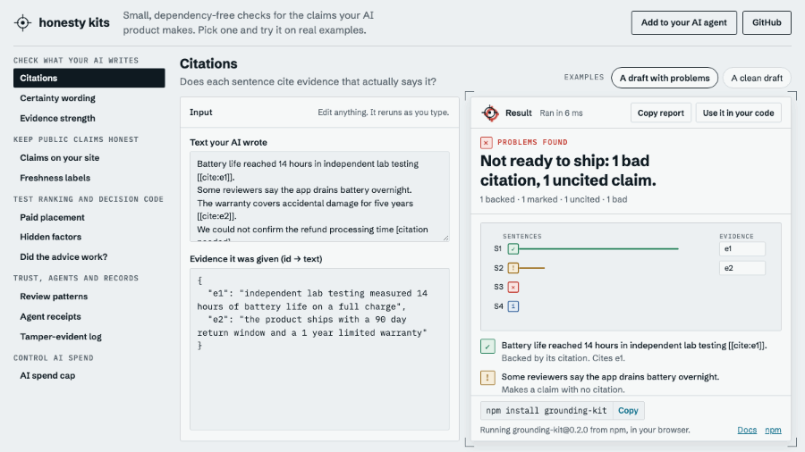

# honesty kits

Small, dependency-free TypeScript checks for the claims your AI product makes.

[](https://lkopietz3-byte.github.io/honesty-kits/)

**[Try every kit in your browser →](https://lkopietz3-byte.github.io/honesty-kits/)**
Pick a kit, edit a real example, and see the verdict, a graphic of what it found, a fix for each problem and the code to run the same check in CI. The page runs the published npm packages in your browser; nothing you type is sent anywhere.

## The kits

Each kit is its own npm package, MIT licensed, with zero runtime dependencies and no network calls. Use one, or several.

### Check what your AI writes

| Kit | What it checks | Try it |
| --- | --- | --- |
| [grounding-kit](https://github.com/lkopietz3-byte/grounding-kit) | Does each sentence cite evidence that actually says it? Flags uncited claims and citations that point at the wrong evidence. | [playground](https://lkopietz3-byte.github.io/honesty-kits/#grounding-kit) |
| [provenance-kit](https://github.com/lkopietz3-byte/provenance-kit) | Does the copy sound more certain than its source allows ("independently verified", "guaranteed")? | [playground](https://lkopietz3-byte.github.io/honesty-kits/#provenance-kit) |
| [corroboration-kit](https://github.com/lkopietz3-byte/corroboration-kit) | How strong is the evidence for a claim, and does it point for or against it? | [playground](https://lkopietz3-byte.github.io/honesty-kits/#corroboration-kit) |

### Keep public claims honest

| Kit | What it checks | Try it |
| --- | --- | --- |
| [claims-registry-kit](https://github.com/lkopietz3-byte/claims-registry-kit) | Is every claim on your site still backed by evidence someone checked recently? | [playground](https://lkopietz3-byte.github.io/honesty-kits/#claims-registry-kit) |
| [freshness-kit](https://github.com/lkopietz3-byte/freshness-kit) | How old is this information, and what should its "last reviewed" label say? | [playground](https://lkopietz3-byte.github.io/honesty-kits/#freshness-kit) |

### Test ranking and decision code

| Kit | What it checks | Try it |
| --- | --- | --- |
| [payout-invariance-kit](https://github.com/lkopietz3-byte/payout-invariance-kit) | Would your rankings change if a partner paid you more? | [playground](https://lkopietz3-byte.github.io/honesty-kits/#payout-invariance-kit) |
| [mutation-invariance-kit](https://github.com/lkopietz3-byte/mutation-invariance-kit) | Does a decision change when a field it should ignore (zip code, say) changes? | [playground](https://lkopietz3-byte.github.io/honesty-kits/#mutation-invariance-kit) |
| [advice-ledger-kit](https://github.com/lkopietz3-byte/advice-ledger-kit) | After someone followed a recommendation, did the problem actually get better? | [playground](https://lkopietz3-byte.github.io/honesty-kits/#advice-ledger-kit) |

### Trust, agents and records

| Kit | What it checks | Try it |
| --- | --- | --- |
| [trust-core](https://github.com/lkopietz3-byte/trust-core) | Do anonymous reviews look organic, or like a pattern worth a closer look? Plus credibility-weighted scores for known reviewers. | [playground](https://lkopietz3-byte.github.io/honesty-kits/#trust-core) |
| [agent-receipt-kit](https://github.com/lkopietz3-byte/agent-receipt-kit) | Did your AI agent stay inside what it was allowed to do, and do its claims match what you see? | [playground](https://lkopietz3-byte.github.io/honesty-kits/#agent-receipt-kit) |
| [audit-chain-kit](https://github.com/lkopietz3-byte/audit-chain-kit) | Has anyone edited or deleted entries in this log after the fact? | [playground](https://lkopietz3-byte.github.io/honesty-kits/#audit-chain-kit) |

### Control AI spend

| Kit | What it checks | Try it |
| --- | --- | --- |
| [cost-governor-kit](https://github.com/lkopietz3-byte/cost-governor-kit) | Will the next model call push you over budget? Cache-aware pricing and a pre-call ceiling. | [playground](https://lkopietz3-byte.github.io/honesty-kits/#cost-governor-kit) |

## Use them from your AI coding agent

[honesty-mcp](https://github.com/lkopietz3-byte/honesty-mcp) wraps eleven of the kits as tools for Claude Code, Cursor, VS Code and any other MCP client. It runs on your machine with npx.

```bash
claude mcp add honesty-mcp -- npx -y honesty-mcp
```

[Add to VS Code](https://insiders.vscode.dev/redirect/mcp/install?name=honesty-mcp&config=%7B%22command%22%3A%22npx%22%2C%22args%22%3A%5B%22-y%22%2C%22honesty-mcp%22%5D%7D) · [Cursor and other clients](https://lkopietz3-byte.github.io/honesty-kits/#add-to-agent)

## How they behave

- **No dependencies, no network.** Each package ships plain ESM with types. Nothing phones home.
- **Strict about input.** Malformed input throws a clear error instead of producing a plausible wrong answer.
- **Honest about limits.** Every kit's README has a section on its limits, and every result in the playground says what the kit does not check. A structural citation check is not a fact check; passing a scenario test is evidence, not a proof.
- **Built to run in CI.** The playground's "Use it in your code" button gives you the same check as a module that exits with code 1 when it finds a problem.

## This repository

The playground is static HTML and two ES modules, with no build step beyond wrapping the page:

```bash
npm install        # installs the exact kit versions the page loads
npm test           # runs every example and every generated snippet against the real kits
node tools/build.mjs && npx serve dist
```

`node tools/demo-gif.mjs --playwright-root <path to playwright>` re-records `docs/demo.gif` from the live site, and `tools/og.mjs` re-captures the social card.

MIT licensed.
